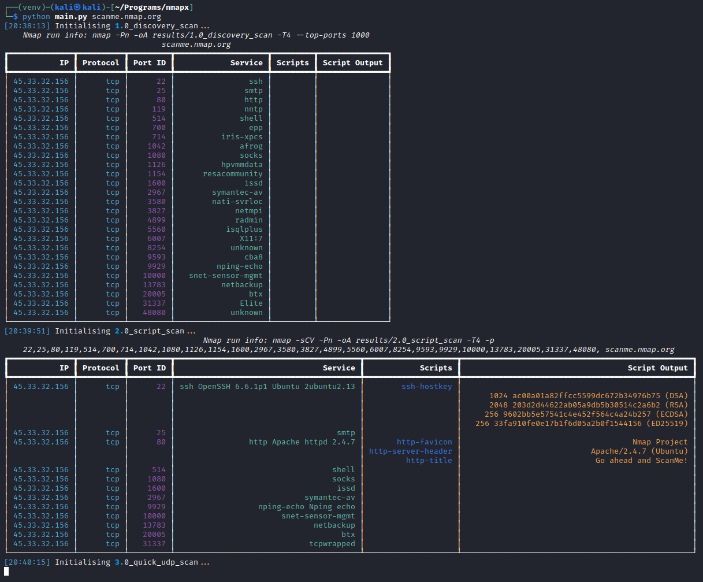

# Nmapx

Inspired by https://github.com/josevnz/home_nmap

Python tool for running a bunch of Nmap scripts with prettier output and saving the output files.

Example CLI output

You can define a set of scans to be run too (CLI flag to specify a scan file coming soon)

Results will be saved in the following structure: 
<ul>
<li>Results</li>
  <ul>
    <li>Specified output directory</li>
      <ul>
        <li>Scan 1</li>
          <ul>
            <li>IP 1</li>
            <li>IP 2</li>
          </ul>
        <li>Scan 2</li>
      </ul>
  </ul>
